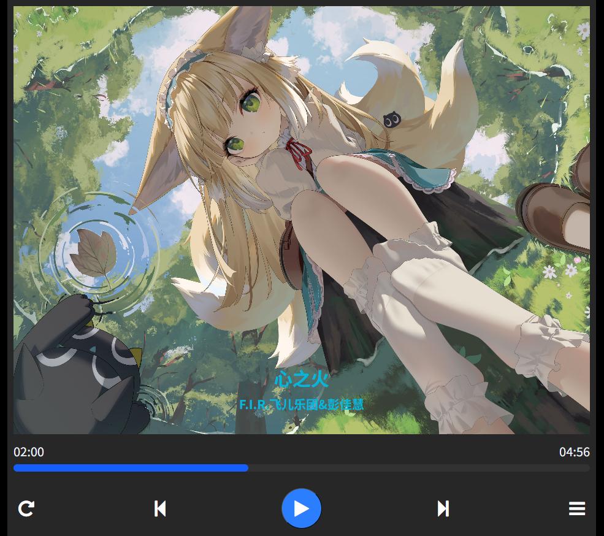

一个跑本地服务的音乐播放器

### How to use

```base
npm install
npm run dev

# or

yarn install
yarn dev
```

You should see Server running on http://localhost:3000

### Todo List

- [x] 上一首
- [x] 下一首
- [x] 歌曲列表
- [x] 播放/暂停
- [x] 重新播放
- [x] 进度条跳转
- [x] 歌词展示


